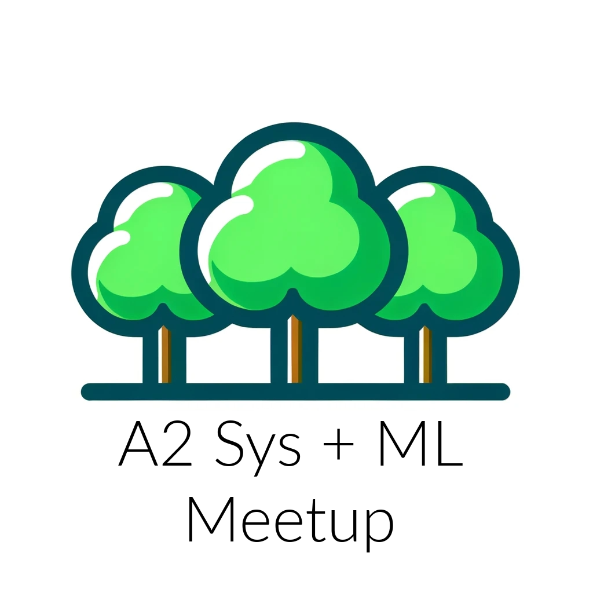

# a2-sys-ml-meetup
principles, motivations and marketing

## Motivation

I really just want a "hacker" atmosphere. I think I'll focus mostly on systems and ML. I think it'll be a mix of research, personal projects and presentations. I want it to be an atmosphere where a conversation can start and anyone can show their stuff off. Tech for the sake of tech. No Agile EVER. No fixation on large orgs (digital transformation, cloud migration for the sake of compliance, methodologies). MAYBE Startups. Badass shit. Modern tooling like Rust. SOTA databases, ML systems, compute, static analysis. Heavy engineering focus. Frontend only if there was interesting ENGINEERING (on the order of diff -> signal algorithms in implementation of frontend frameworks).

## Content

Very open to begin with. I'll need to measure what people want during the first meeting. I really want an open discussion. Maybe we can partition by interests? Networking could eventually be mixed in as there are a few tech companies and the local college.

## Venue / Time

AADL Downtown Freespace Room (3rd floor). Saturdays at 11am - 12pm.

## Marketing:

Need to measure and execute campaigns on Reddit, Facebook, Meetup, EventBrite and Email. Measure clicks on these via UTM + GA4. 

UTMS (use utm_content to A/B test newsletter variations + flyer locations):
- newsletter: https://www.a2sysml.xyz?utm_source=newsletter&utm_medium=email&utm_campaign=target_date&utm_content=default
- flyer: https://www.a2sysml.xyz?utm_source=flyer&utm_medium=physical&utm_campaign=target_date&utm_content=default
- reddit: https://www.a2sysml.xyz?utm_source=reddit&utm_medium=social_media&utm_campaign=target_date
- facebook: https://www.a2sysml.xyz?utm_source=facebook&utm_medium=social_media&utm_campaign=target_date
- eventbrite: https://www.a2sysml.xyz?utm_source=eventbrite&utm_medium=meetup_platform&utm_campaign=target_date
- meetup: https://www.a2sysml.xyz?utm_source=meetup&utm_medium=meetup_platform&utm_campaign=target_date

### Flyers

The link to the current flyer is in the Google Drive. For each location, make a specific UTM.

For cheap, easy to use (no laminator) laminate pouches: https://www.amazon.com/Self-Adhesive-Laminating-Machine-Sealing-Laminate/dp/B0C2HSHMT2

Colored printing can be found at the Westgate Staples for $0.70/copy. Print 8.5" x 11".

### Newsletter

We use Zoho campaigns to send newsletter and updates. In case we need to switch providers, there was a bit of setup in Zoho (email templates, subscribe/unsubcribe flow, the signup form). 

Send email flow: write email in markdown, add to website, clone old campaign, convert markdown to HTML and paste, send (it may need to get approved).

## Feedback

Feedback can be gathered through the form accessible on the website. In case we need to change the form or view results, it is in the Google Drive.

## Engagement

We will use email for weekly newsletters/announcements and Slack for topic specific communication.

Slack link (there are channels for anything, ml and systems right now): https://a2sysml.slack.com/join/shared_invite/zt-296caufsy-aQAZfhTHjdB3exoSIWwPow#/shared-invite/email

If you need to join newsletter, please use button on website. See Marketing > Newsletter to see how to send newsletter/update.

## Next Steps

Looking to meet Saturday, December 30th, 2023.

TODO:
- Design flyers (logo /w text, qr code to website (make sure this has UTM for tracking), blurb describing goals/first meeting setting, use photoshop or some other free software)
- book room (freespace, saturday 11am dec 30th)
- find 5 points of interest for flyers (make separate UTM codes to measure effectiveness), aim for 10-20 colored + laminated copies when printing at staples
- Put forms, complete website (check for any glaring issues, add parking/transit instructions (with map))
- Write promotions on EventBrite, Meetup, Reddit, Facebook w/ UTM links for understanding where time needs to be invested in.
- Advertise + write first newsletter (keep this simple, use markdown, include parking/transit instructions)
